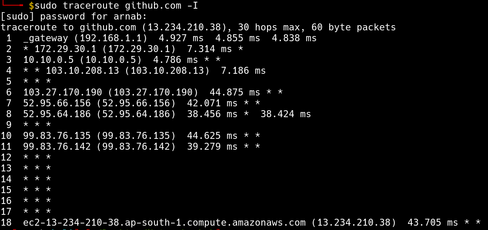
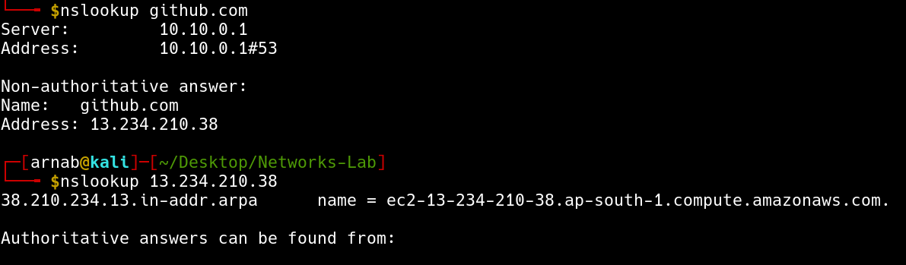
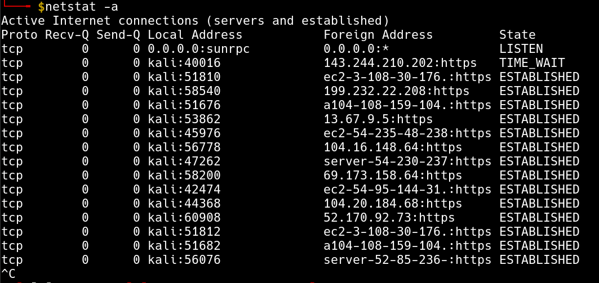

# Assignment 1

- **Name:** Arnab Sen
- **Roll:** 510519006
- **Gsuite:** 510519006.arnab@students.iiests.ac.in
- **Subject:** Computer Networks Lab (CS 3272)

## Question 1

Read the man pages of ifconfig, ping, traceroute, arp, dig, nslookup, and netstat and write their utilities in brief.

## Answer 1

### `ifconfig`

- used to configure kernel-resident network interfaces.
- displays detailed information about the active interfaces.

### `ping`

- checks if the internet connection to the destination host is available or not.
- gives information about the round-trip delay in communicating with the host.
- tells us the percentage of packet losss.

### `traceroute`

- helps figure out the routing hops data has to go through, as well as response delays as it travels across nodes.
- enables you to locate where the data was unable to be sent along, known as points of failure.

### `arp`

- viewing and modifying the local Address Resolution Protocol (ARP) cache, which contains recently resolved MAC addresses of Internet Protocol (IP) hosts on the network.

### `dig`

- query information about various DNS records.

### `nslookup`

- use to diagnose Domain Name System (DNS) infrastructure.
- If the host is an Internet address and the query type is A or PTR, the nslookup command returns the name of the host.
- If the host is a name and does not have a trailing period, the search list is used to qualify the name.

### `netstat`

- Displays active TCP connections, ports on which the computer is listening, Ethernet statistics, the IP routing table, IPv4 statistics (for the IP, ICMP, TCP, and UDP protocols), and IPv6 statistics (for the IPv6, ICMPv6, TCP over IPv6, and UDP over IPv6 protocols).

---

## Question 2

Find the IP and hardware addresses of your machine using ifconfig command.

## Answer 2

- IP address is: `192.168.0.8`.
- HW address is: `FE:1F:A3:C5:7D:68`.

---

## Question 3

Use `ping <AnyURL>` command and find out
i. the average RTT (round trip time).
ii. the %packet loss.
iii. size of packet that is sent to `<AnyURL>` server.
iv. size of packet that is received by your machine.

## Answer 3

1. Average RTT is: `61.572 ms`.
2. Packet Loss is: `36.3636%`.
3. Size of packet sent ot `github.com` is: `56 bytes`.
4. Size of packet received is: `64 bytes`.

---

## Question 4

Use `dig <AnyURL>` command and find out
i. the IP address of `<AnyURL>`.
ii. the IP addresses of DNS servers.

## Answer 4

1. IP Address of `github.com` is: `13.234.210.38`.
2. IP Address of DNS server is: `10.10.0.1`.

---

## Question 5

Use `traceroute <AnyURL>` and find out
i. number of hops in between your machine and `<AnyURL>` server.
ii. the IP address of your network gateway of your subnet.

## Answer 5

1. Number of hops between my machine and `github.com` is: `18`.
2. IP address of my network gateway is: `192.168.1.1`.

---

## Question 6

Use `arp` command to find out the MAC address of the device that is performing as your network gateway.

## Answer 6

MAC address of the device that is performing as my network gateway is: `7d:b9:6c:44:d3:e6`.

---

## Question 7

Use `nslookup <AnyURL>` command and find out the IP address of `<AnyURL>`.Use `nslookup <IP address>` command and perform reverse domain lookup.

## Answer 7

- IP address of `github.com` is: `13.234.210.38`.
- Doing a reversse domain lookup I got: `ec2-13-234-210-38.ap-south-1.compute.amazonaws.com`

---

## Question 8

Use netstat command and find out the active connections of your machine.

## Answer 8

