# Assignment 2

- **Name:** Arnab Sen
- **Roll:** 510519006
- **Gsuite:** 510519006.arnab@students.iiests.ac.in
- **Subject:** Computer Networks Lab (CS 3272)

## Question 1

Check the version of the `tcpdump` and the `libpcap` utilities. Also find the number of interfaces available with your computer. Switch the network of `eth0/eth1` (or the ethernet interface name as appeared) to promiscuous mode.

## Answer 1

```bash
tcpdump --version
```

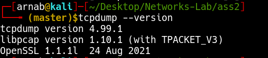

- tcpdump version `4.99.1`
- libpcap version `1.10.1`

My network interfaces are:

```bash
tcpdump -D
```

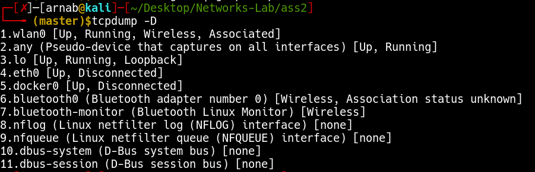

So `wlan0` is my active interface. Enabled promiscuous mode of `wlan0`.

```bash
sudo ifconfig wlan0 promisc
sudo ifconfig -v | grep -i promisc
```

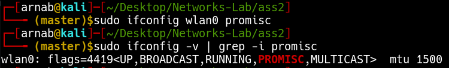

## Question 2

Write the `tcpdump` command to capture 20 packets by listening to the promiscuous mode interface of your host and save the result as *.pcap file (both with and without -n option).

## Answer 2

### Without -n option

```bash
sudo tcpdump -i wlan0 -c 20 -w capture1.pcap
```

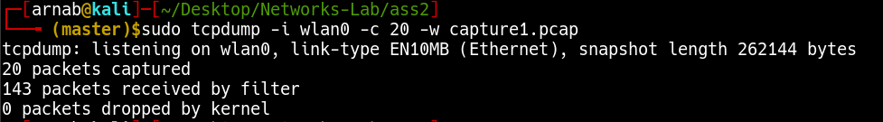

### With -n option

```bash
sudo tcpdump -n -i wlan0 -c 20 -w capture2.pcap
```

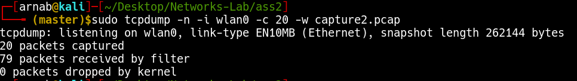

## Question 3

Read the above file and identify the different fields present in TCP/IP packets captured by `tcpdump`.

## Answer 3

To parse and read the content we use the `-r` tag.

```bash
tcpdump -r capture1.pcap
```

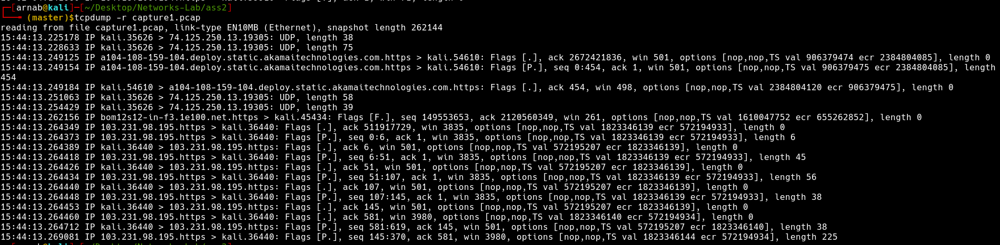

```bash
tcpdump -r capture2.pcap
```

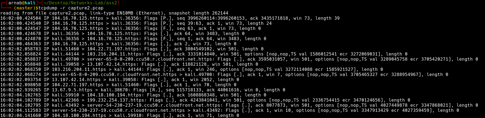

Taking look into one packet from `capture1.pcap`:

```bash
15:44:13.249154 IP a104-108-159-104.deploy.static.akamaitechnologies.com.https > kali.54610: Flags [P.], seq 0:454, ack 1, win 501, options [nop,nop,TS val 906379475 ecr 2384804085], length 454
```

| Data | Description |
|---|---|
| `15:44:13.249154` | timestamp of the received packet as per the local clock. |
| IP |  IP represents the network layer protocol—in this case, `IPv4`.|
| `a104-108-159-104.deploy.static.akamaitechnologies.com.https` | source, since we didn't use the `-n` tag it shows the name instead of IP and PORT |
| `kali.54610` | destination, this is my local kali machine |
| `Flags [P.]` | P represents `PUSH` and `.` represents `ACK` hence `[P.]` means `PUSH-ACK` |
| `seq 0:454` | sequence number |
| `ack 1` | Ack Number which is 1 since this is the side sending data. For the side receiving data, this field represents the next expected byte (data) on this flow. |
| `win 501`| Window Size, which represents the number of bytes available in the receiving buffer |
| `length 454` | Packet Length, which represents the length, in bytes, of the payload data. |

## Question 4

Extract packet arrival time, source IP address, destination IP address and port.

## Answer 4

```bash
$ tcpdump -tttt -n -r capture2.pcap -c 1
2022-01-18 16:02:00.424504 IP 104.16.70.125.443 > 192.168.1.4.36356: Flags [P.], seq 3996260114:3996260153, ack 3435171818, win 73, length 39
```

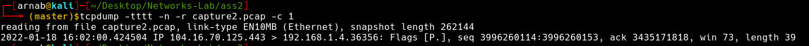

- packet arrival time: `2022-01-18 16:02:00.424504`
- source IP address is `104.16.70.125` and PORT is `443`
- destination IP address is `192.168.1.4` and PORT is `36356`

## Question 5

Extract source MAC address and destination MAC addresses.

## Answer 5

To get MAC address we use the `-e` tag.

```bash
$ tcpdump -tttt -en -r capture2.pcap -c 1
2022-01-18 16:02:00.424504 7c:a9:6b:33:c3:d6 > 24:ee:9a:81:09:25, ethertype IPv4 (0x0800), length 93: 104.16.70.125.443 > 192.168.1.4.36356: Flags [P.], seq 3996260114:3996260153, ack 3435171818, win 73, length 39
```

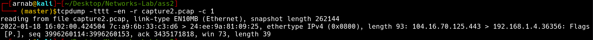

- Source MAC address: `7c:a9:6b:33:c3:d6`
- Destination MAC address: `24:ee:9a:81:09:25`

## Question 6

Get the inter-arrival times while capturing packets.

## Answer 6

The `-ttt` tag allows us to capture packets and show inter-arrival time instead of arrival time in result.

```bash
sudo tcpdump -ttt
```

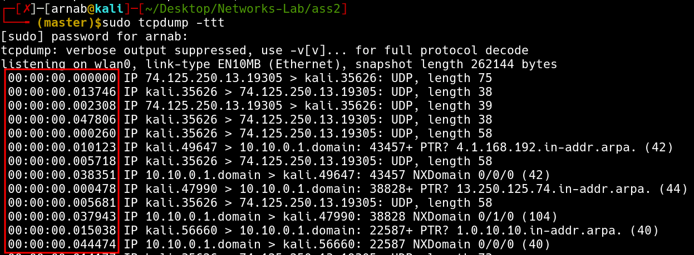

## Question 7

Use `tcpdump` to capture HTTP/HTTPS request and reply from `www.google.com`. Also print the packet content in ASCII format.

## Answer 7

Since we want only HTTP/HTTPS requests so the port should be either `80` or `443`. We also have to specify the request source and destination as `www.google.com`. For printing the content in ASCII format we use the `-A` tag.

```bash
sudo tcpdump -A '(dst www.google.com or src www.google.com) and (port 80 or port 443)'
```

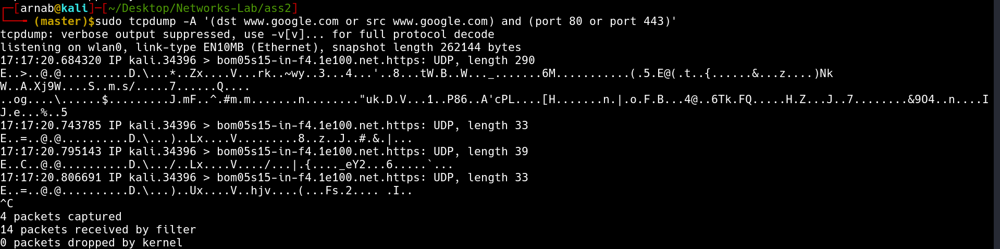

## Question 8

For each command, use `tcpdump` to capture the associated packets, and explain the different fields of each request and reply: (i) `ping` (ii) `wget` (iii) `traceroute`.

## Answer 8

Running the corresponding command and the `tcpdump` simultaneously.

### `ping`

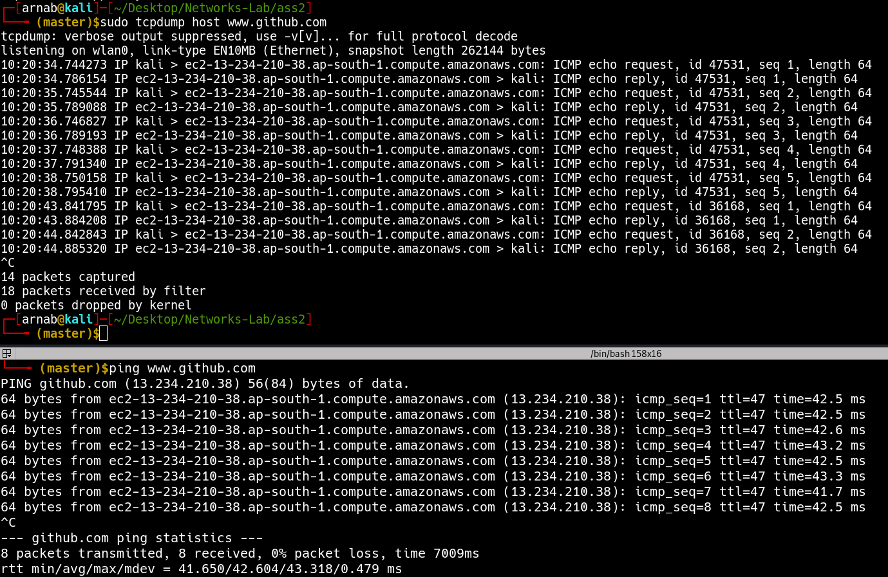

We know that `ping` uses the ICMP protocol and we can see in `tcpdump` that the requests from my machine are `icmp echo request` and the corresponding response is `icmp echo reply`.

```bash
10:20:34.744273 IP kali > ec2-13-234-210-38.ap-south-1.compute.amazonaws.com: ICMP echo request, id 47531, seq 1, length 64
10:20:34.786154 IP ec2-13-234-210-38.ap-south-1.compute.amazonaws.com > kali: ICMP echo reply, id 47531, seq 1, length 64
```

In the first request the source is `kali` and the destination is `ec2-13-234-210-38.ap-south-1.compute.amazonaws.com` which is the github server. The protocol used is `ICMP` because it was `ping` command. And the packet length is `64` which is default packet length for `ping`.

In the second repy the source is the github.com server `ec2-13-234-210-38.ap-south-1.compute.amazonaws.com` and the destination is `kali`. Everything else is same.

### `wget`

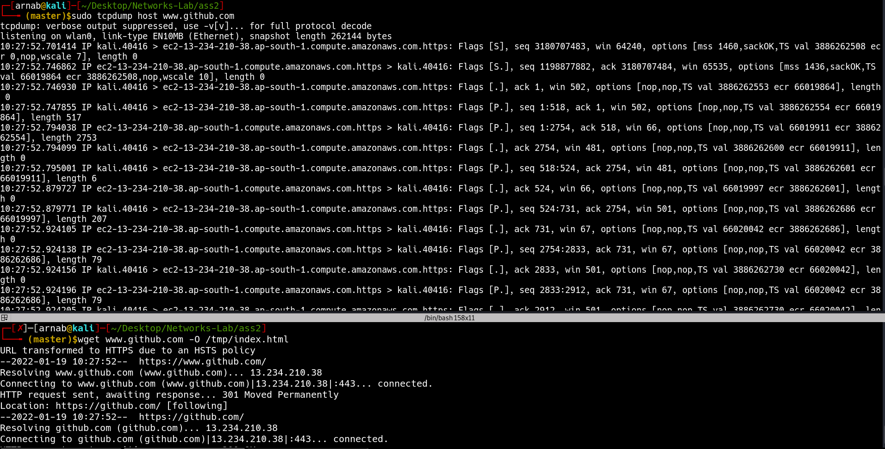

Going through the first few packets:

```bash
10:27:52.701414 IP kali.40416 > ec2-13-234-210-38.ap-south-1.compute.amazonaws.com.https: Flags [S], seq 3180707483, win 64240, options [mss 1460,sackOK,TS val 3886262508 ecr 0,nop,wscale 7], length 0
10:27:52.746862 IP ec2-13-234-210-38.ap-south-1.compute.amazonaws.com.https > kali.40416: Flags [S.], seq 1198877882, ack 3180707484, win 65535, options [mss 1436,sackOK,TS val 66019864 ecr 3886262508,nop,wscale 10], length 0
10:27:52.746930 IP kali.40416 > ec2-13-234-210-38.ap-south-1.compute.amazonaws.com.https: Flags [.], ack 1, win 502, options [nop,nop,TS val 3886262553 ecr 66019864], length 0
10:27:52.747855 IP kali.40416 > ec2-13-234-210-38.ap-south-1.compute.amazonaws.com.https: Flags [P.], seq 1:518, ack 1, win 502, options [nop,nop,TS val 3886262554 ecr 66019864], length 517
10:27:52.794038 IP ec2-13-234-210-38.ap-south-1.compute.amazonaws.com.https > kali.40416: Flags [P.], seq 1:2754, ack 518, win 66, options [nop,nop,TS val 66019911 ecr 3886262554], length 2753
```

| Packet # | Source | Destination | Packet type | Packet Length |
| 1 | `kali` | `ec2-13-234-210-38.ap-south-1.compute.amazonaws.com` | `HTTPS` request with `SYN` flag | 0 |
| 2 | `ec2-13-234-210-38.ap-south-1.compute.amazonaws.com` | `kali` | `HTTPS` reply with `SYN-ACK` flag | 0 |
| 3 | `kali` | `ec2-13-234-210-38.ap-south-1.compute.amazonaws.com` | `HTTPS` request with `ACK` flag | 0 |
| 4 | `kali` | `ec2-13-234-210-38.ap-south-1.compute.amazonaws.com` | `HTTPS` request with `PUSH-ACK` flag | 517 |
| 5 | `ec2-13-234-210-38.ap-south-1.compute.amazonaws.com` | `kali` | `HTTPS` reply with `PUSH-ACK` flag | 2753 |

### `traceroute`

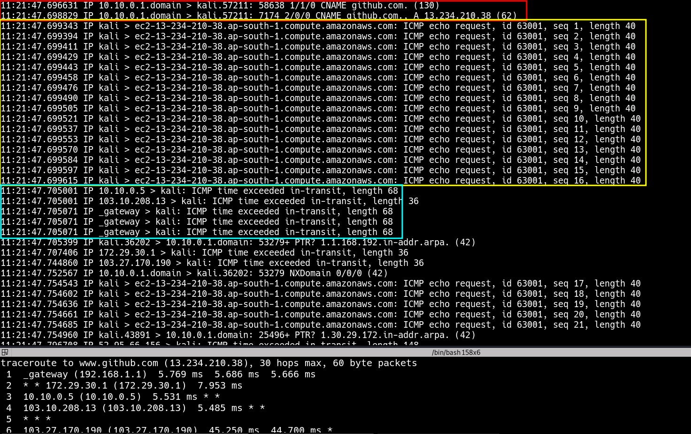

Since I am using tracerote with `-I` it will send ICMP requests and we can see that. If we analyse the packets we see first a DNS resolution happens.

```bash
11:21:47.696631 IP 10.10.0.1.domain > kali.57211: 58638 1/1/0 CNAME github.com. (130)
11:21:47.698829 IP 10.10.0.1.domain > kali.57211: 7174 2/0/0 CNAME github.com., A 13.234.210.38 (62)
```

Then some `ICMP ECHO` requests are sent.

```bash
11:21:47.699343 IP kali > ec2-13-234-210-38.ap-south-1.compute.amazonaws.com: ICMP echo request, id 63001, seq 1, length 40
```

Few of them responds with `ICMP time exceeded in-transit` which is expected since that's how traceroute works.

```bash
11:21:47.705001 IP 10.10.0.5 > kali: ICMP time exceeded in-transit, length 68
11:21:47.705001 IP 103.10.208.13 > kali: ICMP time exceeded in-transit, length 36
11:21:47.705071 IP _gateway > kali: ICMP time exceeded in-transit, length 68
11:21:47.705071 IP _gateway > kali: ICMP time exceeded in-transit, length 68
11:21:47.705071 IP _gateway > kali: ICMP time exceeded in-transit, length 68
11:21:47.707406 IP 172.29.30.1 > kali: ICMP time exceeded in-transit, length 36
11:21:47.744860 IP 103.27.170.190 > kali: ICMP time exceeded in-transit, length 36
11:21:47.796708 IP 52.95.66.156 > kali: ICMP time exceeded in-transit, length 148
11:21:47.799213 IP 103.27.170.190 > kali: ICMP time exceeded in-transit, length 36
11:21:50.015732 IP 52.95.64.186 > kali: ICMP time exceeded in-transit, length 36
11:21:50.023428 IP 99.83.76.135 > kali: ICMP time exceeded in-transit, length 148
11:21:50.113708 IP 99.83.76.142 > kali: ICMP time exceeded in-transit, length 36
```

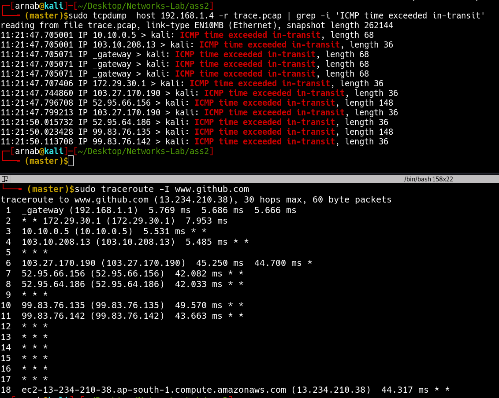

Also, we can notice that the IPs from the ICMP Time Limit Exceeded matches exactly with the IPs from the traceroute command.

## Question 9

Write the `tcpdump` command that captures packets containing TCP packets with a specific IP address as (i) both source and destination, (ii) only source, and (iii) only destination.

## Answer 9

### (i) Both Source and Destination

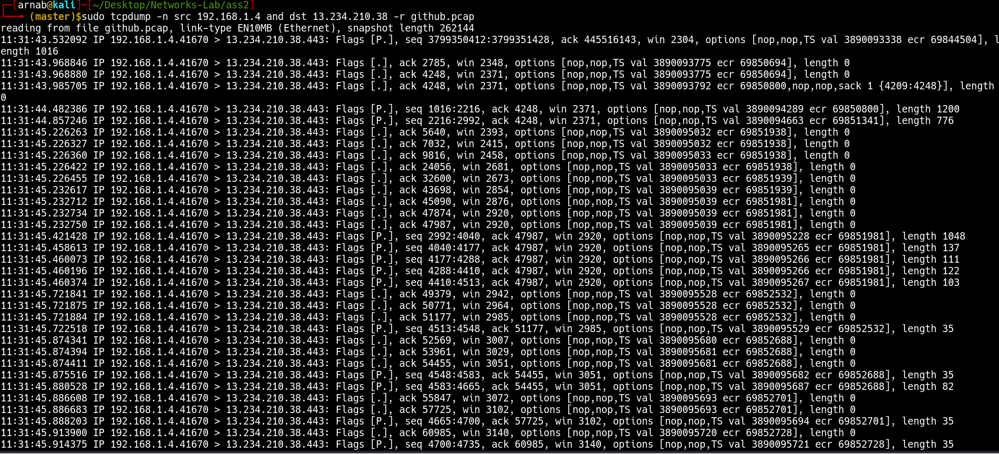

Here source is my local ip and destination is `13.234.210.38` (www.github.com's IP)

### (ii) Only Source

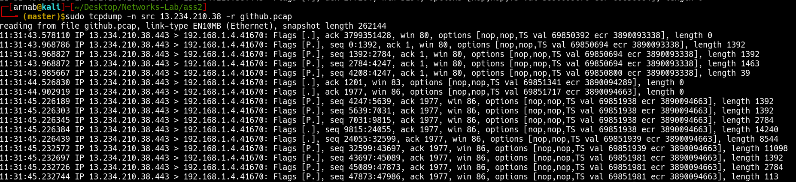

Here source is `13.234.210.38`.

### (iii) Only Destination

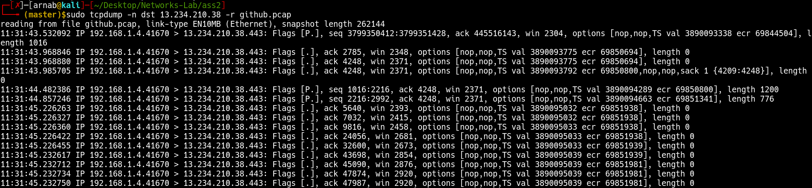

Here destination is `13.234.210.38`

## Quuestion 10

Write the `tcpdump` command that captures packets containing ICMP packets between two hosts with different IP addresses.

## Answer 10

We know `ping` uses ICMP protocol, so using it to generate some ICMP requests. Since, we need the IP so we are using the `-n` flag as well.

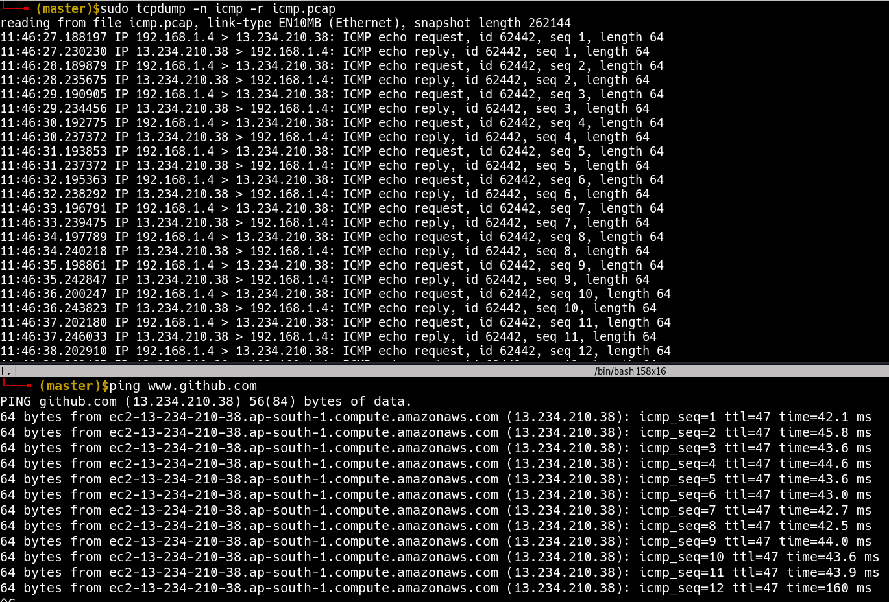

## Question 11

Write the `tcpdump` command to capture packets containing SSH request and reply between two specific IP addresses (hint: use port number 22 for SSH)

## Answer 11

```bash
sudo tcpdump -n port 22 -r ssh.pcap
```

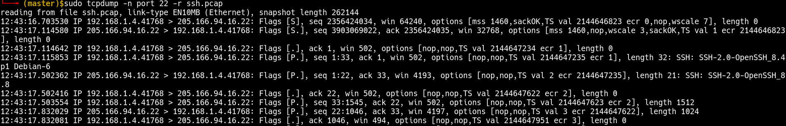
