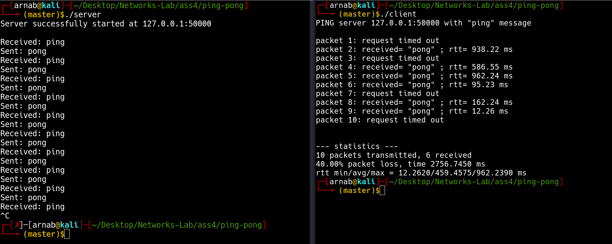
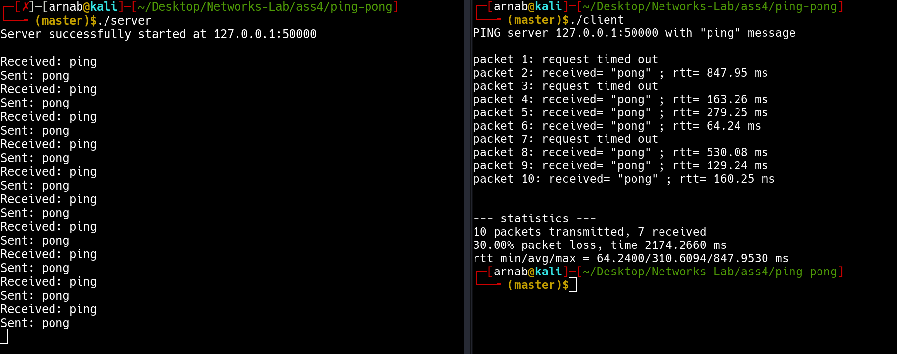
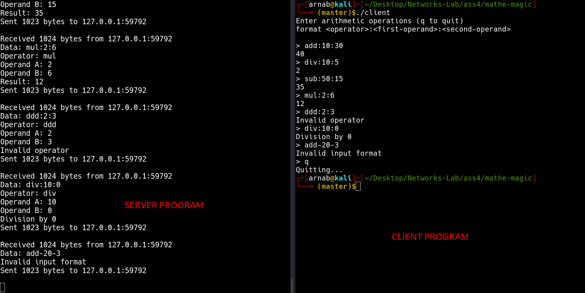

# Assignment 4

- **Name:** Arnab Sen
- **Roll:** 510519006
- **Gsuite:** 510519006.arnab@students.iiests.ac.in
- **Subject:** Computer Networks Lab (CS 3272)

---

## Ping-Pong

### Code

#### `server.c`

```cpp
/**
 * @file server.c
 * @author Arnab Sen (arnabsen1729@gmail.com)
 * @brief Server program of ping-pong game
 *
 * The server will listen for incoming connections and send back pong
 * messages for every ping message received.
 *
 * @date 2022-02-19
 */

#include <arpa/inet.h>
#include <errno.h>
#include <netinet/in.h>  // Internet family of protocols
#include <stdbool.h>
#include <stdio.h>
#include <stdlib.h>
#include <string.h>
#include <sys/socket.h>
#include <sys/types.h>
#include <time.h>
#include <unistd.h>

#define PORT 50000
#define BUFFSIZE 1024

/**
 * @brief Sleep for a amount of time in milliseconds
 *
 * @param msec
 * @return int
 */
int msleep(long msec) {
  struct timespec ts;
  int res;

  if (msec < 0) {
    errno = EINVAL;
    return -1;
  }

  ts.tv_sec = msec / 1000;
  ts.tv_nsec = (msec % 1000) * 1000000;

  do {
    res = nanosleep(&ts, &ts);
  } while (res && errno == EINTR);

  return res;
}

int main() {
  srand(time(NULL));

  int soc;
  struct sockaddr_in server_addr;
  struct sockaddr_in client_addr;
  int data_bytes;
  socklen_t client_addr_len;
  char buff[BUFFSIZE];

  /*
    create a socket based on UDP protocol
  */
  if ((soc = socket(PF_INET, SOCK_DGRAM, 0)) == -1) {
    perror("cannot create socket");
    return 0;
  }

  /*
    initialize the address structure
  */
  server_addr.sin_family = PF_INET;
  server_addr.sin_addr.s_addr = INADDR_ANY;  // inet_addr("127.0.0.1") ;
                                             // Converts to 32-bit number
  server_addr.sin_port = htons(PORT);        // Port number - byte order

  /*
    bind the socket to the address
  */
  if ((bind(soc, (struct sockaddr *)&server_addr, sizeof(server_addr))) < 0) {
    perror("cannot bind");
    return 0;
  }

  printf("Server successfully started at 127.0.0.1:%d\n\n", PORT);

  client_addr_len = sizeof(client_addr);

  while (true) {
    // receive ping from client
    data_bytes = recvfrom(soc, buff, BUFFSIZE - 1, 0,
                          (struct sockaddr *)&client_addr, &client_addr_len);
    if (data_bytes < 0) {
      perror("cannot receive");
      return 1;
    }

    buff[data_bytes] = '\0';
    printf("Received: %s\n", buff);

    strcpy(buff, "pong");

    /*
      before responding with pong we are simulating a latency
      to simulate a network delay
    */
    msleep(rand() % 2000);

    // send pong to client
    data_bytes = sendto(soc, buff, data_bytes, 0,
                        (struct sockaddr *)&client_addr, client_addr_len);

    if (data_bytes < 0) {
      perror("cannot send");
      return 1;
    }

    printf("Sent: %s\n", buff);
  }

  return 0;
}
```

#### `client.c`

```cpp
/**
 * @file client.c
 * @author Arnab Sen (arnabsen1729@gmail.com)
 * @brief Client program of ping-pong game
 *
 * The client will send 10 ping messages and determine the RTT for each message.
 *
 * @date 2022-02-19
 */

#include <arpa/inet.h>
#include <limits.h>
#include <netinet/in.h>  // Internet family of protocols
#include <stdio.h>
#include <stdlib.h>
#include <sys/socket.h>
#include <time.h>
#include <unistd.h>

#define SERVERIP "127.0.0.1"
#define PORT 50000
#define BUFFSIZE 1024

/**
 * @brief Sets a timeout to the socket
 *
 * This prevents waitind indefinitely for a response from the server.
 * If the server does not respond within the timeout, it will trigger
 * an error.
 *
 * @param soc The socket descriptor to set the timeout on
 * @param sec The timeout in seconds
 */
void setTimeOut(int soc, int sec) {
  struct timeval tv;
  tv.tv_sec = sec;
  tv.tv_usec = 0;
  if (setsockopt(soc, SOL_SOCKET, SO_RCVTIMEO, &tv, sizeof(tv)) < 0) {
    perror("setsockopt failed");
    exit(EXIT_FAILURE);
  }
}

/**
 * @brief returns the time difference in microseconds
 *
 * @param start start time
 * @param end end time
 * @return uint64_t time difference in microseconds
 */
uint64_t difftime_us(struct timespec start, struct timespec end) {
  return (end.tv_sec - start.tv_sec) * 1000000 +
         (end.tv_nsec - start.tv_nsec) / 1000;
}

int main() {
  // data structures to store stats
  struct timespec start, end;
  int total_responses = 0;
  double total_time = 0, min_time = INT_MAX, max_time = 0;

  int soc_des;                   // socket file descriptor
  struct sockaddr_in dest_addr;  // socket destination address structure
  int dest_addr_len;             // length of the destination address structure
  char ping[] = "ping";          // ping message
  char buff[BUFFSIZE];           // buffer for receiving data
  int dest_bytes = sizeof(ping);

  /*
    create a socket based on UDP protocol
  */
  if ((soc_des = socket(PF_INET, SOCK_DGRAM, 0)) == -1) {
    perror("cannot create socket");
    return 0;
  }

  /*
    initialize the destination address structure
  */
  dest_addr.sin_family = PF_INET;  // Internet family of protocols
  dest_addr.sin_addr.s_addr = inet_addr(SERVERIP);  // Server IP
  dest_addr.sin_port = htons(PORT);  // Server port - changing byte order
  dest_addr_len = sizeof(dest_addr);

  /*
    set timeout for receiving data
  */
  setTimeOut(soc_des, 1);

  printf("PING server %s:%d with \"ping\" message\n\n", SERVERIP, PORT);

  /*
    send 10 ping messages to the server
  */
  for (int i = 0; i < 10; i++) {
    // noting down the time BEFORE sending the ping message
    clock_gettime(CLOCK_MONOTONIC_RAW, &start);

    // send ping message to server
    int data_sent = sendto(soc_des, ping, dest_bytes, 0,
                           (struct sockaddr *)&dest_addr, sizeof(dest_addr));
    if (data_sent < 0) {
      perror("cannot send");
      continue;
    }

    // receive response from server
    int data_received = recvfrom(soc_des, buff, BUFFSIZE - 1, 0,
                                 (struct sockaddr *)&dest_addr, &dest_addr_len);

    printf("packet %d: ", i + 1);

    if (data_received < 0) {
      printf("request timed out\n");
      continue;
    }

    buff[data_received] = '\0';

    // noting down the time AFTER receiving the ping message
    clock_gettime(CLOCK_MONOTONIC_RAW, &end);

    uint64_t delta_us = difftime_us(start, end);
    double time_taken_ms = (double)(delta_us) / 1000;

    // log details
    printf("received= \"%s\" ; rtt= %.2f ms \n", buff, time_taken_ms);

    /*
      update the statistics
    */
    total_responses++;
    total_time += time_taken_ms;
    if (time_taken_ms < min_time) {
      min_time = time_taken_ms;
    }
    if (time_taken_ms > max_time) {
      max_time = time_taken_ms;
    }
  }

  close(soc_des);

  /*
    print the statistics
  */
  printf("\n\n--- statistics ---\n", total_responses);
  printf(
      "10 packets transmitted, %d received\n%.2f%% packet loss, time %.4f "
      "ms\n",
      total_responses, (10 - total_responses) * 10.0, total_time);
  printf("rtt min/avg/max = %.4f/%.4f/%.4f ms\n", min_time,
         total_time / total_responses, max_time);
  return 0;
}
```

### Screenshots





---

## Mathe-magic

### Code

#### `server.c`

```cpp
/**
 * @file server.c
 * @author Arnab Sen (arnabsen1729@gmail.com)
 * @brief Server program for mathe-magic
 *
 * Server receives the command sent from the client.
 * Parses the command and then calculates the result.
 * If the command is invalid, it will return an error message.
 *
 * @date 2022-02-19
 */

#include <arpa/inet.h>
#include <netinet/in.h>  // Internet family of protocols
#include <stdbool.h>
#include <stdio.h>
#include <stdlib.h>
#include <string.h>
#include <sys/socket.h>
#include <time.h>
#include <unistd.h>

#define PORT 50000
#define BUFFSIZE 1024

/**
 * @brief Parse the encoded command
 *
 * The command is of the format
 * <operator>:<first-operand>:<second-operand>
 *
 * @param input The encoded command
 * @param op pointer to the operator
 * @param a pointer to the first operand
 * @param b pointer to the second operand
 * @return true if the command was parsed successfully
 * @return false if the command was not parsed successfully
 */
bool parseInput(char *input, char *op, int *a, int *b) {
  /*
    The first call to strtok must pass the C string to tokenize, and subsequent
    calls must specify NULL as the first argument, which tells the function to
    continue tokenizing the string you passed in first.

    Source: https://stackoverflow.com/a/23456549/11910267
  */

  char *token = strtok(input, ":");
  if (token == NULL) {
    return false;
  }
  strcpy(op, token);  // grab the operator
  token = strtok(NULL, ":");
  if (token == NULL) {
    return false;
  }
  *a = atoi(token);  // convert the first operand to an integer
  token = strtok(NULL, ":");
  if (token == NULL) {
    return false;
  }
  *b = atoi(token);  // convert the second operand to an integer

  // if we got here, the command was parsed successfully
  return true;
}

/**
 * @brief Perform the operation and return the result
 *
 * The flag determines if the operation was valid
 *  0 -> success
 *  1 -> division by 0
 *  2 -> invalid operator (not add, sub, mul, div)
 *
 * @param op the operator
 * @param a the first operand
 * @param b the second operand
 * @param flag flag (status of the operation)
 * @return int final result of the operation
 */
int getResult(char *op, int a, int b, int *flag) {
  if (strcmp(op, "add") == 0) {
    return a + b;
  } else if (strcmp(op, "sub") == 0) {
    return a - b;
  } else if (strcmp(op, "mul") == 0) {
    return a * b;
  } else if (strcmp(op, "div") == 0) {
    if (b == 0) {
      // division by 0
      *flag = 1;
      return 0;
    }
    return a / b;
  } else {
    // invalid operator
    *flag = 2;
    return -1;
  }
}

int main() {
  int soc;
  struct sockaddr_in server_addr;
  struct sockaddr_in client_addr;
  char buff[BUFFSIZE];
  socklen_t client_addr_len = sizeof(client_addr);
  /*
    create a socket based on UDP protocol
  */
  soc = socket(PF_INET, SOCK_DGRAM, 0);
  if (soc < 0) {
    perror("socket");
    exit(1);
  }

  /*
    initialize the address structure
  */
  server_addr.sin_family = PF_INET;
  server_addr.sin_addr.s_addr = INADDR_ANY;
  server_addr.sin_port = htons(PORT);

  /*
    bind the socket to the address
  */
  if (bind(soc, (struct sockaddr *)&server_addr, sizeof(server_addr)) < 0) {
    perror("bind");
    exit(1);
  }

  printf("Server successfully started at 127.0.0.1:%d\n\n", PORT);

  while (true) {
    // receive the command from the client
    int n = recvfrom(soc, buff, BUFFSIZE, 0, (struct sockaddr *)&client_addr,
                     &client_addr_len);
    if (n < 0) {
      perror("recvfrom");
      exit(1);
    }

    // log the command
    printf("Received %d bytes from %s:%d\n", n, inet_ntoa(client_addr.sin_addr),
           ntohs(client_addr.sin_port));
    printf("Data: %s\n", buff);

    char operator[4];
    int operand_a, operand_b;
    char response[BUFFSIZE];

    // parse the command
    if (parseInput(buff, operator, & operand_a, &operand_b)) {
      printf("Operator: %s\n", operator);
      printf("Operand A: %d\n", operand_a);
      printf("Operand B: %d\n", operand_b);

      int flag = 0;

      int result = getResult(operator, operand_a, operand_b, &flag);
      if (flag == 0) {
        printf("Result: %d\n", result);
        sprintf(response, "%d", result);
      } else if (flag == 1) {
        printf("Division by 0\n");
        strcpy(response, "Division by 0");
      } else {
        printf("Invalid operator\n");
        strcpy(response, "Invalid operator");
      }
    } else {
      printf("Invalid input format\n");
      strcpy(response, "Invalid input format");
    }

    // send the response to the client
    n = sendto(soc, response, BUFFSIZE - 1, 0, (struct sockaddr *)&client_addr,
               sizeof(client_addr));
    if (n < 0) {
      perror("sendto");
      exit(1);
    }

    // log the response
    printf("Sent %d bytes to %s:%d\n\n", n, inet_ntoa(client_addr.sin_addr),
           ntohs(client_addr.sin_port));
  }

  return 0;
}
```

#### `client.c`

```cpp
/**
 * @file client.c
 * @author Arnab Sen (arnabsen1729@gmail.com)
 * @brief Client program of mathe-magic
 *
 * The client will prompt the user to enter a command.
 * It will be sent to the server and the response will be displayed.
 * @date 2022-02-19
 */

#include <arpa/inet.h>
#include <netinet/in.h>  // Internet family of protocols
#include <stdbool.h>
#include <stdio.h>
#include <stdlib.h>
#include <string.h>
#include <sys/socket.h>
#include <time.h>
#include <unistd.h>

#define SERVERIP "127.0.0.1"
#define PORT 50000
#define BUFFSIZE 1024

/**
 * @brief Sets a timeout to the socket
 *
 * This prevents waitind indefinitely for a response from the server.
 * If the server does not respond within the timeout, it will trigger
 * an error.
 *
 * @param soc The socket descriptor to set the timeout on
 * @param sec The timeout in seconds
 */
void setTimeOut(int soc, int sec) {
  struct timeval tv;
  tv.tv_sec = sec;
  tv.tv_usec = 0;
  if (setsockopt(soc, SOL_SOCKET, SO_RCVTIMEO, &tv, sizeof(tv)) < 0) {
    perror("setsockopt failed");
    exit(EXIT_FAILURE);
  }
}

int main() {
  int soc_des;                   // socket file descriptor
  struct sockaddr_in dest_addr;  // socket destination address structure
  socklen_t dest_addr_len;       // length of the destination address structure
  char ping[] = "ping";          // ping message
  char buff[BUFFSIZE];           // buffer for receiving data
  int dest_bytes = sizeof(ping);

  /*
    create a socket based on UDP protocol
  */
  if ((soc_des = socket(PF_INET, SOCK_DGRAM, 0)) == -1) {
    perror("cannot create socket");
    exit(EXIT_FAILURE);
  }

  /*
    initialize the destination address structure
  */
  dest_addr.sin_family = PF_INET;  // Internet family of protocols
  dest_addr.sin_addr.s_addr = inet_addr(SERVERIP);  // Server IP
  dest_addr.sin_port = htons(PORT);  // Server port - changing byte order
  dest_addr_len = sizeof(dest_addr);

  /*
    set timeout for receiving data
  */
  setTimeOut(soc_des, 1);

  printf("Enter arithmetic operations (q to quit)\n");
  printf("format <operator>:<first-operand>:<second-operand>\n\n");
  while (true) {
    // read input from user
    printf("> ");
    char input[BUFFSIZE];
    scanf("%s", input);

    // check if user wants to quit
    if (strcmp(input, "q") == 0) {
      printf("Quitting...\n");
      break;
    }

    // send input to server
    dest_bytes = sendto(soc_des, input, BUFFSIZE, 0,
                        (struct sockaddr *)&dest_addr, dest_addr_len);
    if (dest_bytes < 0) {
      perror("sendto");
      continue;
    }

    // receive response from server
    dest_bytes = recvfrom(soc_des, buff, BUFFSIZE, 0,
                          (struct sockaddr *)&dest_addr, &dest_addr_len);
    if (dest_bytes < 0) {
      perror("recvfrom");
      continue;
    }

    // print response to the user
    printf("%s\n", buff);
  }

  // close the socket
  close(soc_des);

  return 0;
}
```

### Screenshots



---
