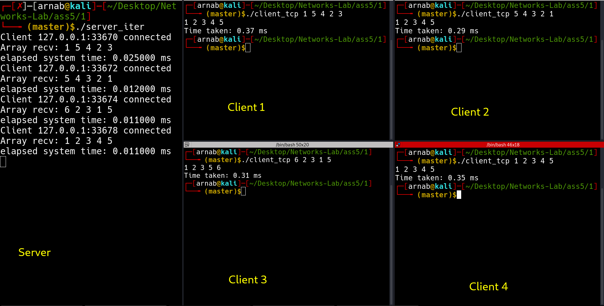
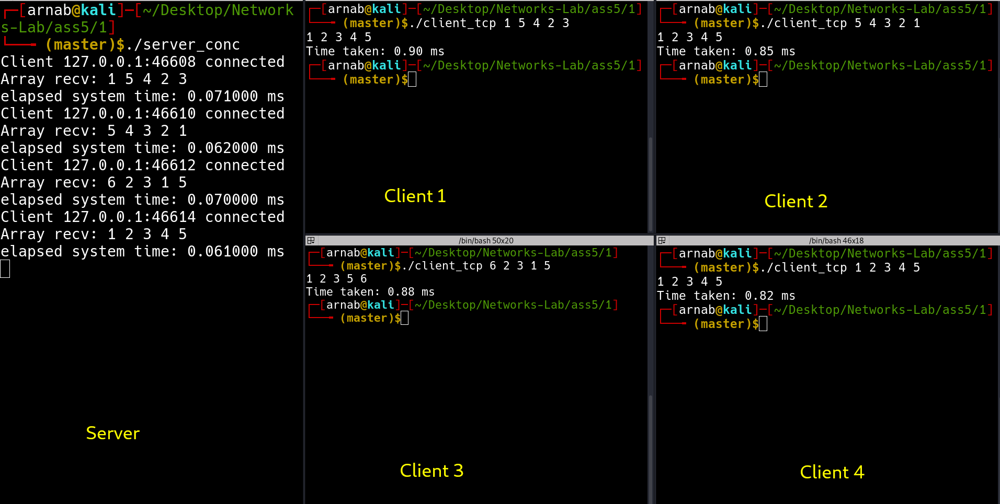
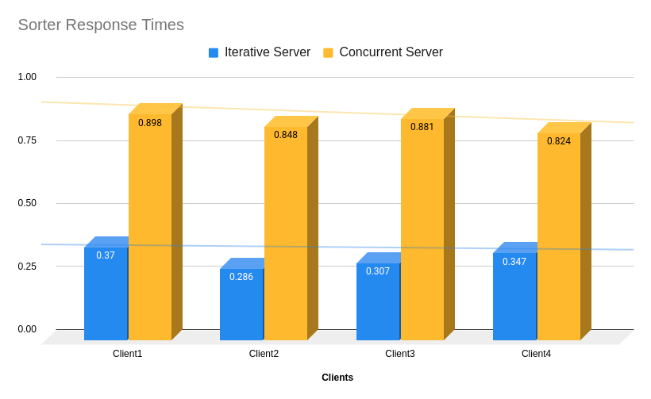
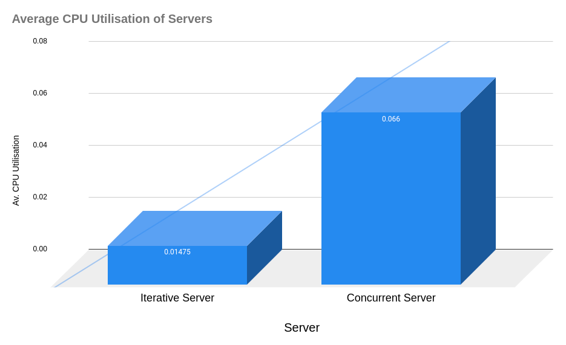
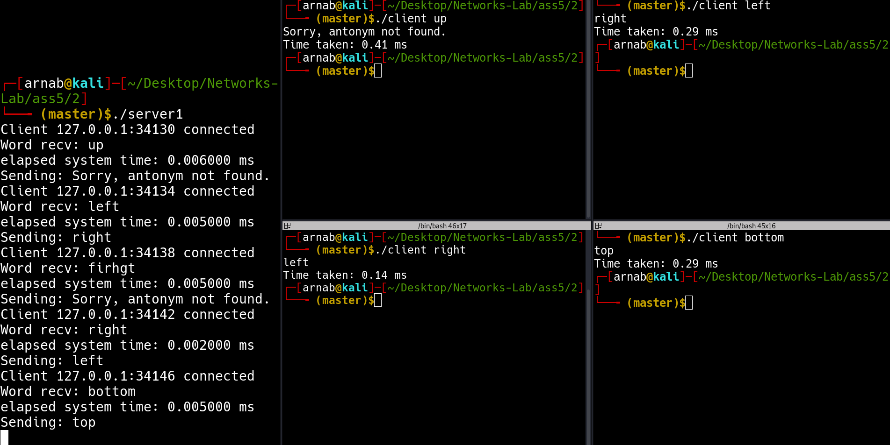
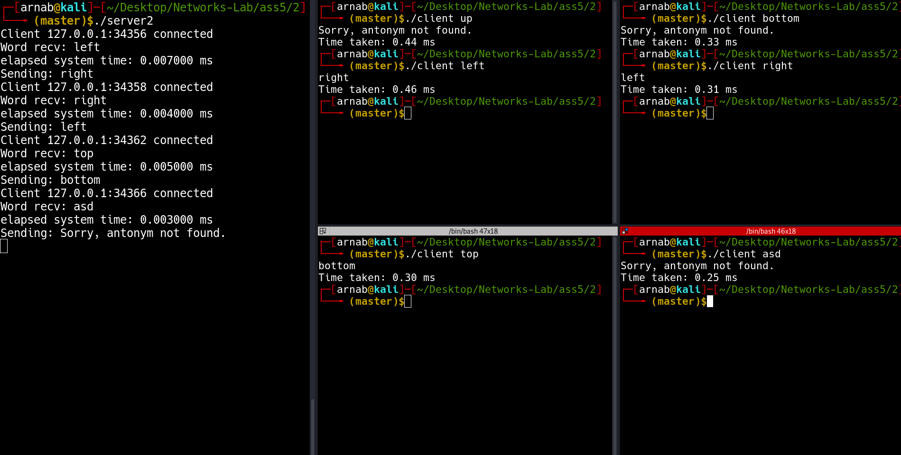
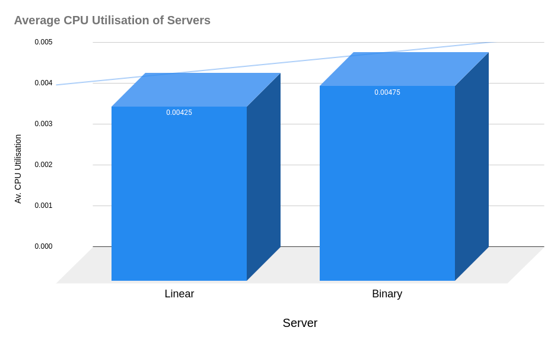

# Assignment 5

- **Name:** Arnab Sen
- **Roll:** 510519006
- **Gsuite:** 510519006.arnab@students.iiests.ac.in
- **Subject:** Computer Networks Lab (CS 3272)

---

## 1. Sorter

### Codes

**server_inter.c** (Server serving clients iteratively)

```cpp
#include <arpa/inet.h>
#include <netinet/in.h>
#include <stdio.h>
#include <stdlib.h>
#include <string.h>
#include <sys/socket.h>
#include <sys/types.h>
#include <time.h>
#include <unistd.h>

#define PORT 6001

void export(FILE *fd, double value, int port) {
  fprintf(fd, "%d, %f\n", port, value);
  fflush(fd);
}

void send_message(int newsockfd, const char *msg) {
  char buf[100];
  for (int i = 0; i < 100; i++) buf[i] = '\0';
  strcpy(buf, msg);
  send(newsockfd, buf, 100, 0);
}

void sort(int *arr, int n) {
  for (int i = 0; i < n - 1; i++) {
    for (int j = 0; j < n - i - 1; j++) {
      if (arr[j] > arr[j + 1]) {
        int t = arr[j];
        arr[j] = arr[j + 1];
        arr[j + 1] = t;
      }
    }
  }
}

void split_and_sort(char *string, char *delim, char *result) {
  result[0] = '\0';
  int array[100];
  int index = 0;

  char *token = strtok(string, delim);
  while (token != NULL) {
    array[index++] = atoi(token);
    token = strtok(NULL, delim);
  }

  sort(array, index);
  for (int i = 0; i < index; i++) {
    char t[100];
    sprintf(t, "%d", array[i]);
    if (i) strcat(result, " ");
    strcat(result, t);
  }
}

int main() {
  FILE *fd = fopen("system_time.csv", "w");
  int sockfd, newsockfd;
  int clilen;
  struct sockaddr_in cli_addr, serv_addr;

  int i;
  char buf[100];

  if ((sockfd = socket(AF_INET, SOCK_STREAM, 0)) < 0) {
    printf("Cannot create socket\n");
    exit(0);
  }

  serv_addr.sin_family = AF_INET;
  serv_addr.sin_addr.s_addr = INADDR_ANY;
  serv_addr.sin_port = htons(PORT);

  if (bind(sockfd, (struct sockaddr *)&serv_addr, sizeof(serv_addr)) < 0) {
    printf("Unable to bind local address\n");
    exit(0);
  }

  listen(sockfd, 5);

  while (1) {
    clilen = sizeof(cli_addr);
    newsockfd = accept(sockfd, (struct sockaddr *)&cli_addr, &clilen);

    if (newsockfd < 0) {
      printf("Accept error\n");
      exit(0);
    }

    printf("Client %s:%d connected\n", inet_ntoa(cli_addr.sin_addr),
           (int)ntohs(cli_addr.sin_port));

    for (i = 0; i < 100; i++) buf[i] = '\0';
    recv(newsockfd, buf, 100, 0);
    printf("Array recv: %s\n", buf);
    char res[100];
    res[0] = '\0';
    clock_t start_clock_time = clock();
    split_and_sort(buf, " ", res);
    clock_t end_clock_time = clock();

    double time_taken =
        ((double)(end_clock_time - start_clock_time)) / CLOCKS_PER_SEC;

    printf("elapsed system time: %f ms\n", time_taken * 1000);
    export(fd, time_taken * 1000, (int)ntohs(cli_addr.sin_port));

    send_message(newsockfd, res);

    close(newsockfd);
  }

  return 0;
}
```

**server_conc.c** (Server serving clients concurrently)

```cpp
#include <arpa/inet.h>
#include <netinet/in.h>
#include <stdio.h>
#include <stdlib.h>
#include <string.h>
#include <sys/socket.h>
#include <sys/types.h>
#include <time.h>
#include <unistd.h>

#define PORT 6001

void export(FILE *fd, double value, int port) {
  fprintf(fd, "%d, %f\n", port, value);
  fflush(fd);
}

void send_message(int newsockfd, const char *msg) {
  char buf[100];
  for (int i = 0; i < 100; i++) buf[i] = '\0';
  strcpy(buf, msg);
  send(newsockfd, buf, 100, 0);
}

void sort(int *arr, int n) {
  for (int i = 0; i < n - 1; i++) {
    for (int j = 0; j < n - i - 1; j++) {
      if (arr[j] > arr[j + 1]) {
        int t = arr[j];
        arr[j] = arr[j + 1];
        arr[j + 1] = t;
      }
    }
  }
}

void split_and_sort(char *string, char *delim, char *result) {
  result[0] = '\0';
  int array[100];
  int index = 0;

  char *token = strtok(string, delim);
  while (token != NULL) {
    array[index++] = atoi(token);
    token = strtok(NULL, delim);
  }

  sort(array, index);
  for (int i = 0; i < index; i++) {
    char t[100];
    sprintf(t, "%d", array[i]);
    if (i) strcat(result, " ");
    strcat(result, t);
  }
}

int main() {
  FILE *fd = fopen("system_time.csv", "w");
  int sockfd, newsockfd;
  int clilen;
  struct sockaddr_in cli_addr, serv_addr;

  int i;
  char buf[100];

  if ((sockfd = socket(AF_INET, SOCK_STREAM, 0)) < 0) {
    printf("Cannot create socket\n");
    exit(0);
  }

  serv_addr.sin_family = AF_INET;
  serv_addr.sin_addr.s_addr = INADDR_ANY;
  serv_addr.sin_port = htons(PORT);

  if (bind(sockfd, (struct sockaddr *)&serv_addr, sizeof(serv_addr)) < 0) {
    printf("Unable to bind local address\n");
    exit(0);
  }

  listen(sockfd, 5);

  while (1) {
    clilen = sizeof(cli_addr);
    newsockfd = accept(sockfd, (struct sockaddr *)&cli_addr, &clilen);

    if (newsockfd < 0) {
      printf("Accept error\n");
      exit(0);
    }

    if (fork() == 0) {
      close(sockfd);

      printf("Client %s:%d connected\n", inet_ntoa(cli_addr.sin_addr),
             (int)ntohs(cli_addr.sin_port));

      clock_t start_clock_time = clock();

      for (i = 0; i < 100; i++) buf[i] = '\0';
      recv(newsockfd, buf, 100, 0);

      printf("Array recv: %s\n", buf);
      char res[100];
      res[0] = '\0';
      split_and_sort(buf, " ", res);

      clock_t end_clock_time = clock();
      double time_taken =
          ((double)(end_clock_time - start_clock_time)) / CLOCKS_PER_SEC;

      printf("elapsed system time: %f ms\n", time_taken * 1000);
      export(fd, time_taken * 1000, (int)ntohs(cli_addr.sin_port));

      send_message(newsockfd, res);

      close(newsockfd);

      exit(0);
    }

    close(newsockfd);
  }
  return 0;
}
```

**client_tcp.c** (Client Code)

```cpp
#include <arpa/inet.h>
#include <netinet/in.h>
#include <stdio.h>
#include <stdlib.h>
#include <string.h>
#include <sys/socket.h>
#include <sys/types.h>
#include <time.h>
#include <unistd.h>

#define PORT 6001

void export(FILE *fd, double value, int port) {
  fprintf(fd, "%d, %f\n", port, value);
}

void recv_and_display(int sockfd) {
  char buf[100];
  for (int i = 0; i < 100; i++) buf[i] = '\0';
  recv(sockfd, buf, 100, 0);
  printf("%s\n", buf);
}

/**
 * @brief returns the time difference in microseconds
 *
 * @param start start time
 * @param end end time
 * @return uint64_t time difference in microseconds
 */
uint64_t difftime_us(struct timespec start, struct timespec end) {
  return (end.tv_sec - start.tv_sec) * 1000000 +
         (end.tv_nsec - start.tv_nsec) / 1000;
}

int main(int argc, char *argv[]) {
  FILE *fd = fopen("response_time.csv", "a");
  int sockfd;
  struct sockaddr_in serv_addr;
  struct timespec start, end;
  struct sockaddr_in local_address;
  int addr_size = sizeof(local_address);

  int i;
  char buf[100];

  if ((sockfd = socket(AF_INET, SOCK_STREAM, 0)) < 0) {
    printf("Unable to create socket\n");
    exit(0);
  }

  serv_addr.sin_family = AF_INET;
  serv_addr.sin_addr.s_addr = inet_addr("127.0.0.1");
  serv_addr.sin_port = htons(PORT);

  if ((connect(sockfd, (struct sockaddr *)&serv_addr, sizeof(serv_addr))) < 0) {
    printf("Unable to connect to server\n");
    exit(0);
  }

  getsockname(sockfd, (struct sockaddr *)&local_address, &addr_size);

  for (i = 0; i < 100; i++) buf[i] = '\0';

  for (int i = 1; i < argc; i++) {
    if (i > 1) strcat(buf, " ");
    strcat(buf, argv[i]);
  }

  strcpy(buf, buf);
  clock_gettime(CLOCK_MONOTONIC_RAW, &start);
  send(sockfd, buf, 100, 0);

  recv_and_display(sockfd);
  clock_gettime(CLOCK_MONOTONIC_RAW, &end);

  uint64_t delta_us = difftime_us(start, end);
  double time_taken_ms = (double)(delta_us) / 1000;
  printf("Time taken: %.2f ms\n", time_taken_ms);
  export(fd, time_taken_ms, (int)ntohs(local_address.sin_port));

  close(sockfd);

  return 0;
}
```

### Outputs

#### Iterative Server



| Port | Respose Times |
|---|---|
| 33670 | 0.370000 |
| 33672 | 0.286000 |
| 33674 | 0.307000 |
| 33678 | 0.347000 |

| Port | CPU Utilisation |
|---|---|
| 33670 | 0.025000 |
| 33672 | 0.012000 |
| 33674 | 0.011000 |
| 33678 | 0.011000 |

**Avg CPU Utilisation :** 0.01475

#### Concurrent Server



| Port | Response Times (in ms) |
|---|---|
| 46608 | 0.898000 |
| 46610 | 0.848000 |
| 46612 | 0.881000 |
| 46614 | 0.824000 |

| Port | CPU Utilisation |
|---|---|
| 46608 | 0.071000 |
| 46610 | 0.062000 |
| 46612 | 0.070000 |
| 46614 | 0.061000 |

**Avg CPU Utilisation :** 0.066 ms

### Observations

Plotting the Response Times we see:



Plotting the average System Times we see:



Clearly we can see that the CPU utilization in case of concurrent server is higher (better) than that of iterative server. This is because in iterative server, the server CPU remains idle even if the process is not in CPU and some I/O mechanism is taking place. But CPU is not allowed to remain idle in a concurrent server.

## 2. Search

### Codes

**server1.c** (Linear Search)

```cpp
#include <arpa/inet.h>
#include <netinet/in.h>
#include <stdio.h>
#include <stdlib.h>
#include <string.h>
#include <sys/socket.h>
#include <sys/types.h>
#include <time.h>
#include <unistd.h>

#define PORT 6001

void export(FILE *fd, double value, int port) {
  fprintf(fd, "%d, %f\n", port, value);
  fflush(fd);
}

char words[][10] = {"top", "bottom", "left", "right", "front", "back"};
char antonyms[][10] = {"bottom", "top", "right", "left", "back", "front"};

void send_message(int newsockfd, const char *msg) {
  char buf[100];
  for (int i = 0; i < 100; i++) buf[i] = '\0';
  strcpy(buf, msg);
  send(newsockfd, buf, 100, 0);
}

int main() {
  FILE *fd = fopen("system_time.csv", "w");
  int sockfd, newsockfd;
  int clilen;
  struct sockaddr_in cli_addr, serv_addr;

  int i;
  char buf[100];
  if ((sockfd = socket(AF_INET, SOCK_STREAM, 0)) < 0) {
    printf("Cannot create socket\n");
    exit(0);
  }

  serv_addr.sin_family = AF_INET;
  serv_addr.sin_addr.s_addr = INADDR_ANY;
  serv_addr.sin_port = htons(PORT);

  if (bind(sockfd, (struct sockaddr *)&serv_addr, sizeof(serv_addr)) < 0) {
    printf("Unable to bind local address\n");
    exit(0);
  }

  listen(sockfd, 5);
  while (1) {
    clilen = sizeof(cli_addr);
    newsockfd = accept(sockfd, (struct sockaddr *)&cli_addr, &clilen);

    if (newsockfd < 0) {
      printf("Accept error\n");
      exit(0);
    }

    printf("Client %s:%d connected\n", inet_ntoa(cli_addr.sin_addr),
           (int)ntohs(cli_addr.sin_port));

    for (i = 0; i < 100; i++) buf[i] = '\0';
    recv(newsockfd, buf, 100, 0);
    printf("Word recv: %s\n", buf);

    clock_t start_clock_time = clock();

    char res[100];
    res[0] = '\0';

    int found = 0;
    for (i = 0; i < 6; i++) {
      if (strcmp(buf, words[i]) == 0) {
        strcpy(res, antonyms[i]);
        found = 1;
      }
    }

    if (found == 0) {
      strcpy(res, "Sorry, antonym not found.");
    }

    clock_t end_clock_time = clock();
    double time_taken =
        ((double)(end_clock_time - start_clock_time)) / CLOCKS_PER_SEC;

    printf("elapsed system time: %f ms\n", time_taken * 1000);
    export(fd, time_taken * 1000, (int)ntohs(cli_addr.sin_port));

    printf("Sending: %s\n", res);
    send_message(newsockfd, res);
    close(newsockfd);
  }

  return 0;
}

```

**server2.c** (Binary Search)

```cpp
#include <arpa/inet.h>
#include <netinet/in.h>
#include <stdio.h>
#include <stdlib.h>
#include <string.h>
#include <sys/socket.h>
#include <sys/types.h>
#include <time.h>
#include <unistd.h>

#define PORT 6001

void export(FILE *fd, double value, int port) {
  fprintf(fd, "%d, %f\n", port, value);
  fflush(fd);
}

typedef struct word_struct {
  char syn[50];
  char ant[50];
} word;

const int count_words = 3;

int cmp(void const *a, void const *b) {
  char const *aa = ((word const *)a)->syn;
  char const *bb = ((word const *)b)->syn;

  return strcmp(aa, bb);
}

word words[3];

void init() {
  strcpy(words[0].syn, "left");
  strcpy(words[0].ant, "right");

  strcpy(words[1].syn, "right");
  strcpy(words[1].ant, "left");

  strcpy(words[2].syn, "top");
  strcpy(words[2].ant, "bottom");
}

void send_message(int newsockfd, const char *msg) {
  char buf[100];
  for (int i = 0; i < 100; i++) buf[i] = '\0';
  strcpy(buf, msg);
  send(newsockfd, buf, 100, 0);
}

int main() {
  init();
  FILE *fd = fopen("system_time.csv", "w");
  qsort(words, count_words, sizeof(word), cmp);

  int sockfd, newsockfd;
  int clilen;
  struct sockaddr_in cli_addr, serv_addr;

  int i;
  char buf[100];
  if ((sockfd = socket(AF_INET, SOCK_STREAM, 0)) < 0) {
    printf("Cannot create socket\n");
    exit(0);
  }

  serv_addr.sin_family = AF_INET;
  serv_addr.sin_addr.s_addr = INADDR_ANY;
  serv_addr.sin_port = htons(PORT);

  if (bind(sockfd, (struct sockaddr *)&serv_addr, sizeof(serv_addr)) < 0) {
    printf("Unable to bind local address\n");
    exit(0);
  }

  listen(sockfd, 5);
  while (1) {
    clilen = sizeof(cli_addr);
    newsockfd = accept(sockfd, (struct sockaddr *)&cli_addr, &clilen);

    if (newsockfd < 0) {
      printf("Accept error\n");
      exit(0);
    }

    printf("Client %s:%d connected\n", inet_ntoa(cli_addr.sin_addr),
           (int)ntohs(cli_addr.sin_port));

    for (i = 0; i < 100; i++) buf[i] = '\0';
    recv(newsockfd, buf, 100, 0);
    printf("Word recv: %s\n", buf);

    clock_t start_clock_time = clock();

    char res[100];
    res[0] = '\0';
    int low = 0;
    int high = count_words - 1;
    int mid;
    int found = 0;
    while (low <= high) {
      mid = (low + high) / 2;
      int cmp = strcmp(buf, words[mid].syn);
      if (cmp == 0) {
        strcpy(res, words[mid].ant);
        found = 1;
        break;
      } else if (cmp < 0) {
        high = mid - 1;
      } else {
        low = mid + 1;
      }
    }

    if (found == 0) {
      strcpy(res, "Sorry, antonym not found.");
    } else {
    }

    clock_t end_clock_time = clock();
    double time_taken =
        ((double)(end_clock_time - start_clock_time)) / CLOCKS_PER_SEC;

    printf("elapsed system time: %f ms\n", time_taken * 1000);
    export(fd, time_taken * 1000, (int)ntohs(cli_addr.sin_port));

    printf("Sending: %s\n", res);
    send_message(newsockfd, res);
    close(newsockfd);
  }

  return 0;
}
```

**client.c** (Client Server)

```cpp
#include <arpa/inet.h>
#include <netinet/in.h>
#include <stdio.h>
#include <stdlib.h>
#include <string.h>
#include <sys/socket.h>
#include <sys/types.h>
#include <time.h>
#include <unistd.h>

#define PORT 5000

void export(FILE *fd, double value, int port) {
  fprintf(fd, "%d, %f\n", port, value);
}

void recv_and_display(int sockfd) {
  char buf[100];
  for (int i = 0; i < 100; i++) buf[i] = '\0';
  recv(sockfd, buf, 100, 0);
  printf("%s\n", buf);
}

/**
 * @brief returns the time difference in microseconds
 *
 * @param start start time
 * @param end end time
 * @return uint64_t time difference in microseconds
 */
uint64_t difftime_us(struct timespec start, struct timespec end) {
  return (end.tv_sec - start.tv_sec) * 1000000 +
         (end.tv_nsec - start.tv_nsec) / 1000;
}

int main(int argc, char *argv[]) {
  FILE *fd = fopen("response_time.csv", "a");
  int sockfd;
  struct sockaddr_in serv_addr;
  struct sockaddr_in local_address;
  int addr_size = sizeof(local_address);
  struct timespec start, end;
  int i;
  char buf[100];

  if ((sockfd = socket(AF_INET, SOCK_STREAM, 0)) < 0) {
    printf("Unable to create socket\n");
    exit(0);
  }

  serv_addr.sin_family = AF_INET;
  serv_addr.sin_addr.s_addr = inet_addr("127.0.0.1");
  serv_addr.sin_port = htons(PORT);

  if ((connect(sockfd, (struct sockaddr *)&serv_addr, sizeof(serv_addr))) < 0) {
    printf("Unable to connect to server\n");
    exit(0);
  }

  getsockname(sockfd, (struct sockaddr *)&local_address, &addr_size);

  for (i = 0; i < 100; i++) buf[i] = '\0';

  strcpy(buf, argv[1]);
  clock_gettime(CLOCK_MONOTONIC_RAW, &start);
  send(sockfd, buf, 100, 0);

  recv_and_display(sockfd);
  clock_gettime(CLOCK_MONOTONIC_RAW, &end);
  uint64_t delta_us = difftime_us(start, end);
  double time_taken_ms = (double)(delta_us) / 1000;
  printf("Time taken: %.2f ms\n", time_taken_ms);
  export(fd, time_taken_ms, (int)ntohs(local_address.sin_port));

  close(sockfd);

  return 0;
}
```

### Outputs

### Linear Search



| Port | System Time |
|---|---|
| 34134 | 0.005000 |
| 34138 | 0.005000 |
| 34142 | 0.002000 |
| 34146 | 0.005000 |

**Avg CPU Utilisation :** 0.00425

| Port | Response Time |
|---|---|
|34134 | 0.291000 |
|34138 | 0.277000 |
|34142 | 0.137000 |
|34146 | 0.290000 |

### Binary Search



| Port | System Time |
|---|---|
| 34356 | 0.007000 |
| 34358 | 0.004000 |
| 34362 | 0.005000 |
| 34366 | 0.003000 |

**Avg CPU Utilisation :** 0.00475

| Port | Response Time |
|---|---|
| 34356 | 0.162000 |
| 34358 | 0.313000 |
| 34362 | 0.296000 |
| 34366 | 0.246000 |

### Observations

Plotting the response times we see:


Plotting the avg CPU utilizations we see:



Thus, we notice that the CPU utilization is better for concurrent server which performs binary search than that for concurrent server which performs linear search. Linear search depends on the position of the words in the dictionary and the words given as input. The performance of the linear search server is better when the searched word is towards the start of the list, otherwise Binary Search server performs better. It also depends on the position of the words after sorting in case of binary search.
