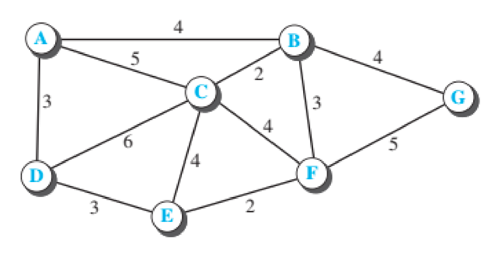
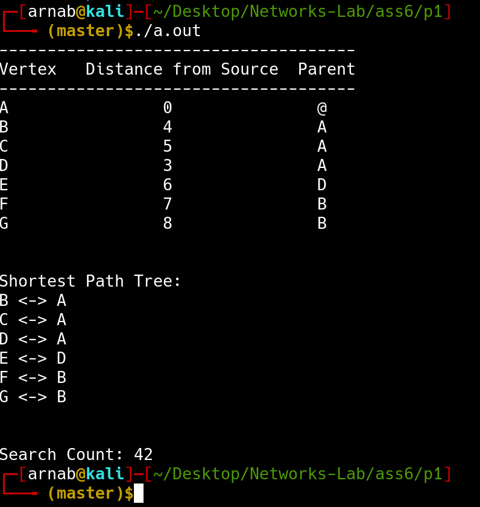
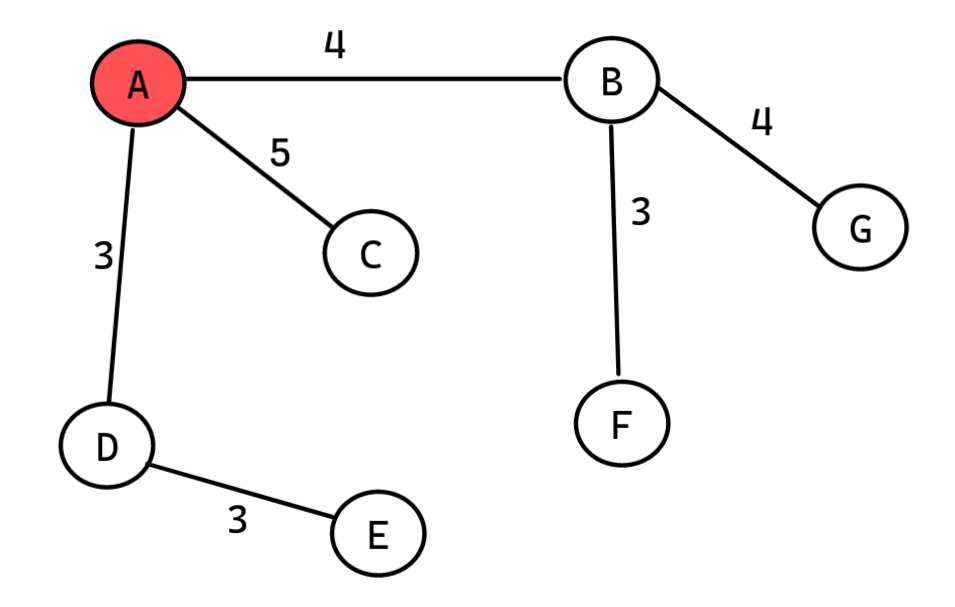
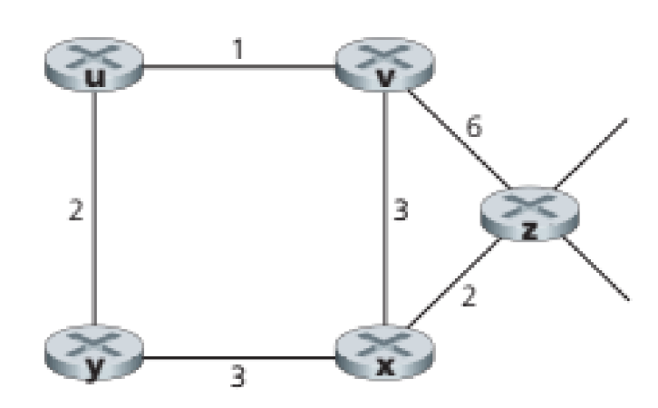
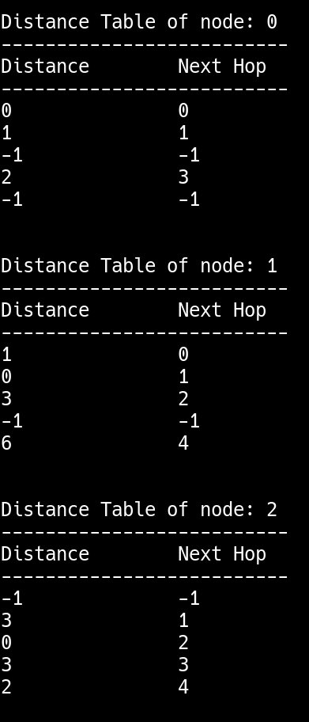
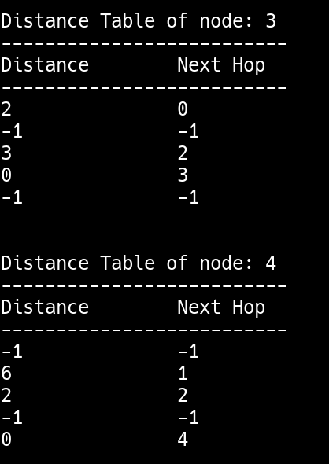
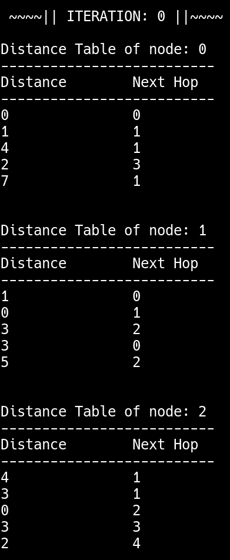
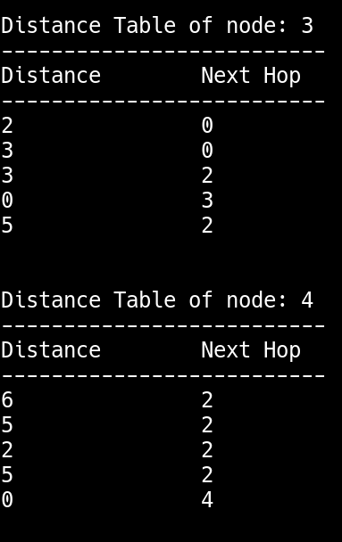
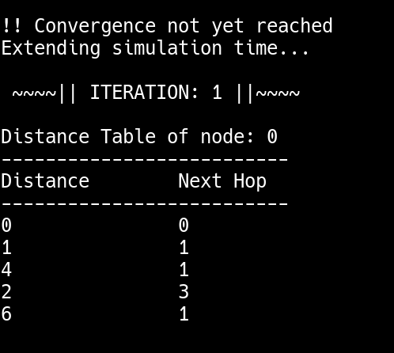
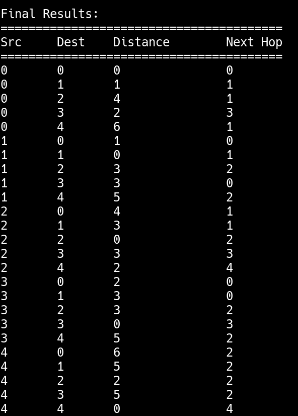

# Assignment 6

- **Name:** Arnab Sen
- **Roll:** 510519006
- **Gsuite:** 510519006.arnab@students.iiests.ac.in
- **Subject:** Computer Networks Lab (CS 3272)

---

## 1. Link State Routing

Implement the Dijkstra’s algorithm (LS routing) to find the shortest path tree and the forwarding table for node A in the given network. To find the complexity of Dijkstra’s algorithm, find the number of searches we have to do to find the shortest path for a single node when the number of nodes is n.



### Code

```cPP
#include <limits.h>
#include <stdbool.h>
#include <stdio.h>
#include <stdlib.h>

int n = 7;   // number of nodes
int m = 12;  // number of edges
int adj[][7] = {
                {0, 4, 5, 3, 0, 0, 0}, {4, 0, 2, 0, 0, 3, 4},
                {5, 2, 0, 6, 4, 4, 0}, {3, 0, 6, 0, 3, 0, 0},
                {0, 0, 4, 3, 0, 2, 0}, {0, 3, 4, 0, 2, 0, 5},
                {0, 4, 0, 0, 0, 5, 0}
};

void dijkstra(int src) {
  int dist[n];
  int parent[n];

  bool visited[n];

  for (int i = 0; i < n; i++) dist[i] = INT_MAX, visited[i] = false;

  dist[src] = 0;
  parent[src] = -1;

  int search = 0;

  for (int count = 0; count < n - 1; count++) {
    int u;

    int min_distance = INT_MAX;

    for (int v = 0; v < n; v++)
      if (visited[v] == false && dist[v] <= min_distance)
        min_distance = dist[v], u = v;

    visited[u] = true;

    for (int v = 0; v < n; v++) {
      if (!visited[v] && adj[u][v] && dist[u] != INT_MAX &&
          dist[u] + adj[u][v] < dist[v]) {
        dist[v] = dist[u] + adj[u][v];
        parent[v] = u;
      }

      search++;
    }
  }

  printf("-------------------------------------\n");
  printf("Vertex   Distance from Source  Parent\n");
  printf("-------------------------------------\n");

  for (int i = 0; i < n; i++) {
    printf("%c \t\t %d \t\t %c \n", i + 'A', dist[i], 'A' + parent[i]);
  }

  printf("\n\n");

  printf("Shortest Path Tree: \n");
  for (int i = 0; i < n; i++) {
    if (i == src) continue;
    printf("%c <-> %c \n", 'A' + i, 'A' + parent[i]);
  }

  printf("\n\n");

  printf("Search Count: %d \n", search);
}

int main() {
  dijkstra(0);
  return 0;
}
```

### Output

Compiling and running the program we get the output:



The shortest path graph looks like:



### Time Complexity

Here the time complexity is of the order of `n^2`. We can see the search count came out to be `42 = (7*6)` and `n = 7`.

> If we had used Priority Queue (Heap) the time complexity could be optimised but there is no implementation of heap in C.

## 2. Distance Vector Routing

Consider the network shown below, and assume that each node initially knows the cost of each of its neighbors. Implement the Bellman-Ford’s algorithm (DV routing) and run simulation for a predefined time period. Output the distance-table entries for every node at regular intervals till the end of simulation. Check if convergence has been achieved or not. If not, increment the simulation duration and make successive attempts to achieve convergence.



### Code

```cpp
#include <stdbool.h>
#include <stdio.h>

#define MAX_VAL 10000

int nodes = 5;
int matrix[5][5] = {
                    {0, 1, MAX_VAL, 2, MAX_VAL},
                    {1, 0, 3, MAX_VAL, 6},
                    {MAX_VAL, 3, 0, 3, 2},
                    {2, MAX_VAL, 3, 0, MAX_VAL},
                    {MAX_VAL, 6, 2, MAX_VAL, 0}
};

int distance_table[5][5][2];

int min(int a, int b) { return a < b ? a : b; }

void init_distance_table() {
  for (int i = 0; i < nodes; i++) {
    for (int j = 0; j < nodes; j++) {
      distance_table[i][j][0] = matrix[i][j];
      distance_table[i][j][1] = (matrix[i][j] < MAX_VAL ? j : -1);
    }
  }
}

void display_distance_table(int node) {
  printf("\nDistance Table of node: %d\n", node);
  printf("--------------------------\n");
  printf("Distance\tNext Hop\n");
  printf("--------------------------\n");
  for (int j = 0; j < nodes; j++) {
    printf("%d\t\t%d\n",
           (distance_table[node][j][0] < MAX_VAL ? distance_table[node][j][0]
                                                 : -1),
           distance_table[node][j][1]);
  }
  printf("\n");
}

bool check_convergence() {
  for (int u = 0; u < nodes; u++) {
    for (int v = 0; v < nodes; v++) {
      // no edge exists
      if (matrix[u][v] != MAX_VAL) continue;

      for (int i = 0; i < nodes; i++) {
        if (distance_table[u][v][0] + distance_table[v][i][0] <
            distance_table[u][i][0]) {
          return false;
        }
      }
    }
  }
  return true;
}

void dvr(int iter) {
  printf("\n ~~~~|| ITERATION: %d ||~~~~\n", iter);
  for (int u = 0; u < nodes; u++) {
    int flag = 0;
    for (int v = 0; v < nodes; v++) {
      // no edge exists
      if (matrix[u][v] == MAX_VAL) continue;

      for (int i = 0; i < nodes; i++) {
        if (distance_table[u][v][0] + distance_table[v][i][0] <
            distance_table[u][i][0]) {
          distance_table[u][i][0] =
              distance_table[u][v][0] + distance_table[v][i][0];
          distance_table[u][i][1] = v;

          flag++;
        }
      }
    }

    if (flag > 0) {
      display_distance_table(u);
    }
  }
}

int main() {
  init_distance_table();
  for (int i = 0; i < nodes; i++) {
    display_distance_table(i);
  }

  printf("Enter simulation duration: ");
  int duration;
  scanf("%d", &duration);

  // implementing bellman ford
  for (int iter = 0; iter < min(duration, nodes - 1); iter++) {
    dvr(iter);
  }

  if (check_convergence()) {
    printf("\nConvergence reached\n");
  } else {
    printf("\n!! Convergence not yet reached\nExtending simulation time...\n");

    for (int iter = duration; iter < nodes - 1; iter++) {
      dvr(iter);
    }
  }

  printf("\n\nFinal Results:\n");
  printf("========================================\n");
  printf("Src\tDest\tDistance\tNext Hop\n");
  printf("========================================\n");
  for (int i = 0; i < nodes; i++) {
    for (int j = 0; j < nodes; j++) {
      printf("%d\t%d\t", i, j);
      if (distance_table[i][j][0] < MAX_VAL) {
        printf("%d\t\t%d\n", distance_table[i][j][0], distance_table[i][j][1]);
      } else {
        printf("INF\t\t-1\n");
      }
    }
  }

  return 0;
}
```

### Output

#### Initial Distance Vector





#### Simulation Duration


#### Iteration Starts





#### Convergence not yet reached



#### Final Direction Vector (Combined)



---
