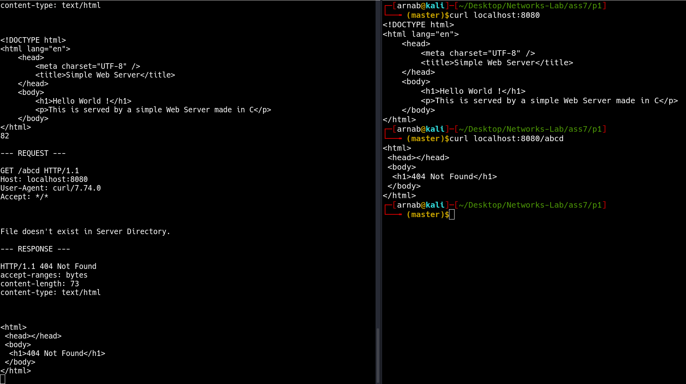
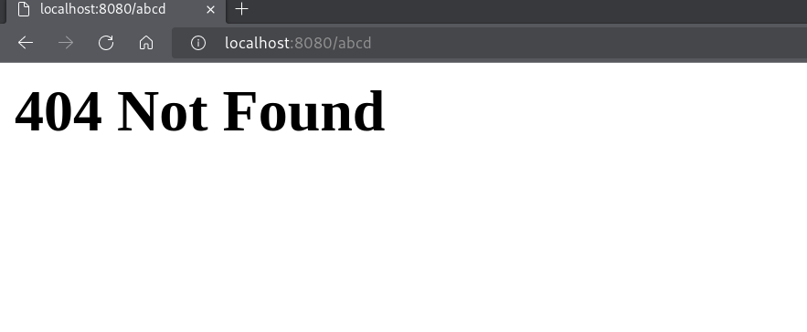
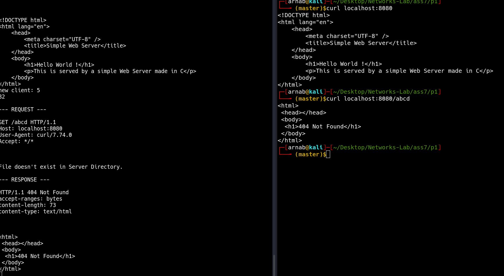
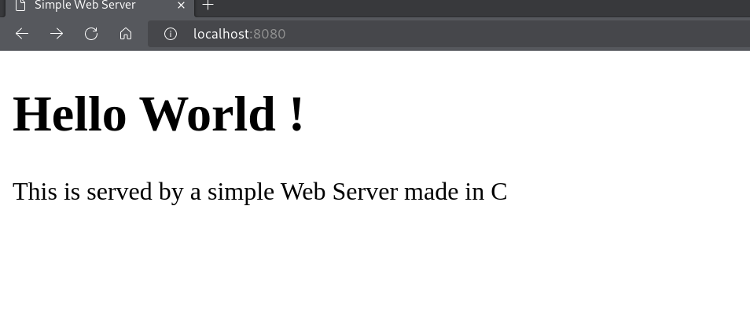

# Assignment 7

- **Name:** Arnab Sen
- **Roll:** 510519006
- **Gsuite:** 510519006.arnab@students.iiests.ac.in
- **Subject:** Computer Networks Lab (CS 3272)

---

## A. Simple Web Server

In this assignment, you will develop a simple Web server in C that is capable of processing only one HTTP
request at a time. Specifically, your Web server will

- (i) create a TCP connection socket when contacted by a client (browser)
- (ii) receive the HTTP request from this connection; (iii) parse the request to determine the specific file being requested; (iv) get the requested file from the serverʼs file system
- (v) create an HTTP response message consisting of the requested file preceded by header lines
- (vi) send the response over the TCP connection to the requesting browser. If a browser requests a file that is not present in your server, your server should return a “404 Not Found” error message.

### Code

```cpp
// Web Server Code

#include <arpa/inet.h>
#include <netinet/in.h>
#include <signal.h>
#include <stdio.h>
#include <stdlib.h>
#include <string.h>
#include <sys/socket.h>
#include <sys/types.h>
#include <unistd.h>

int createSocket() {
  int sockfd;
  if ((sockfd = socket(AF_INET, SOCK_STREAM, 0)) < 0) {
    perror("socket");
    exit(1);
  }
  return sockfd;
}

int sockfd;

void sigintHandler(int sig) {
  printf("\nClosing socket...\n");
  close(sockfd);
  exit(0);
}

const char *not_found_header_template =
    "HTTP/1.1 404 Not Found\r\n"
    "accept-ranges: bytes\r\n"
    "content-length: %ld\r\n"
    "content-type: text/html\r\n\r\n";

const char *ok_header_template =
    "HTTP/1.1 200 OK\r\n"
    "accept-ranges: bytes\r\n"
    "content-length: %ld\r\n"
    "content-type: text/html\r\n\r\n";

int main(int argc, char *argv[]) {
  signal(SIGINT, sigintHandler);

  if (argc < 2) {
    printf("Usage: %s <port>\n", argv[0]);
    exit(1);
  }

  int newsockfd;
  socklen_t client_length;
  struct sockaddr_in client_address, server_address;

  char *token, ch[10000];
  char buf[1000];

  sockfd = createSocket();

  int port = atoi(argv[1]);
  server_address.sin_family = AF_INET;
  server_address.sin_addr.s_addr = INADDR_ANY;
  server_address.sin_port = htons(port);

  int bind_status =
      bind(sockfd, (struct sockaddr *)&server_address, sizeof(server_address));

  if (bind_status < 0) {
    printf("Unable to bind local address\n");
    exit(1);
  }

  listen(sockfd, 5);
  printf("Web Server started at http://%s:%d\n",
         inet_ntoa(server_address.sin_addr), port);
  while (1) {
    client_length = sizeof(client_address);
    newsockfd =
        accept(sockfd, (struct sockaddr *)&client_address, &client_length);

    if (newsockfd < 0) {
      printf("Accept error\n");
      exit(1);
    }

    for (int i = 0; i < 1000; i++) buf[i] = '\0';

    recv(newsockfd, buf, 2500, 0);
    printf("%ld\n", strlen(buf));
    printf("\n--- REQUEST ---\n\n%s\n\n", buf);

    token = strtok(buf, " ");
    token = strtok(NULL, " ");

    if (strcmp(token, "/") == 0) {
      strcpy(token, "/index.html");
    }

    token++;  // ignore the first char i.e '/'
    FILE *fp = fopen(token, "r");

    if (!fp) {
      char http_header[1000];

      const char *error_message =
          "<html>\n <head></head>\n <body>\n  <h1>404 Not "
          "Found</h1>\n </body>\n</html>\r\n";

      sprintf(http_header, not_found_header_template, strlen(error_message));
      printf("File doesn't exist in Server Directory.\n");

      printf("\n--- RESPONSE ---\n\n%s\n\n%s", http_header, error_message);

      send(newsockfd, http_header, strlen(http_header), 0);
      send(newsockfd, error_message, strlen(error_message), 0);
      close(newsockfd);
    } else {
      char http_header[1000];

      printf("File exists in Server Directory\n");
      fseek(fp, 0, SEEK_END);
      long fsize = ftell(fp);
      fseek(fp, 0, SEEK_SET);

      char *data = malloc(fsize + 1);
      fread(data, fsize, 1, fp);

      data[fsize] = 0;

      sprintf(http_header, ok_header_template, fsize);

      printf("\n--- RESPONSE ---\n\n%s\n\n%s", http_header, data);

      send(newsockfd, http_header, strlen(http_header), 0);
      send(newsockfd, data, fsize, 0);
      send(newsockfd, "\r\n", sizeof("\r\n"), 0);
      close(newsockfd);
      fclose(fp);
    }
  }
  close(sockfd);
}
```

### Observations

Compiling the C file with `gcc -o server server.c` and running the server with `./server <port>` will start the server.



We can even visit the page from the browser.


If the endpoint doesn't exist it throws a 404 page.



## B. Multi-threaded Web Server

Currently, the web server handles only one HTTP request at a time. Now. implement a multithreaded server that is capable of serving multiple requests simultaneously. Using threading, first create a main thread in which your modified server listens for clients at a fixed port. When it receives a TCP connection request from a client, it will set up the TCP connection through another port and services the client request in a separate thread. There will be a separate TCP connection in a separate thread for each request/response pair.

### Code

```cpp
// Web Server Code

#include <arpa/inet.h>
#include <netinet/in.h>
#include <pthread.h>
#include <signal.h>
#include <stdio.h>
#include <stdlib.h>
#include <string.h>
#include <sys/socket.h>
#include <sys/types.h>
#include <unistd.h>

int createSocket() {
  int sockfd;
  if ((sockfd = socket(AF_INET, SOCK_STREAM, 0)) < 0) {
    perror("socket");
    exit(1);
  }
  return sockfd;
}

int sockfd;

void sigintHandler(int sig) {
  printf("\nClosing socket...\n");
  close(sockfd);
  exit(0);
}

const char *not_found_header_template =
    "HTTP/1.1 404 Not Found\r\n"
    "accept-ranges: bytes\r\n"
    "content-length: %ld\r\n"
    "content-type: text/html\r\n\r\n";

const char *ok_header_template =
    "HTTP/1.1 200 OK\r\n"
    "accept-ranges: bytes\r\n"
    "content-length: %ld\r\n"
    "content-type: text/html\r\n\r\n";

void *handle_connection(void *newsockfd_ptr) {
  char *token;
  char buf[1000];

  int newsockfd = *((int *)newsockfd_ptr);
  for (int i = 0; i < 1000; i++) buf[i] = '\0';

  recv(newsockfd, buf, 2500, 0);
  printf("%ld\n", strlen(buf));
  printf("\n--- REQUEST ---\n\n%s\n\n", buf);

  token = strtok(buf, " ");
  token = strtok(NULL, " ");

  if (strcmp(token, "/") == 0) {
    strcpy(token, "/index.html");
  }

  token++;  // ignore the first char i.e '/'
  FILE *fp = fopen(token, "r");

  if (!fp) {
    char http_header[1000];

    const char *error_message =
        "<html>\n <head></head>\n <body>\n  <h1>404 Not "
        "Found</h1>\n </body>\n</html>\r\n";

    sprintf(http_header, not_found_header_template, strlen(error_message));
    printf("File doesn't exist in Server Directory.\n");

    printf("\n--- RESPONSE ---\n\n%s\n\n%s", http_header, error_message);

    send(newsockfd, http_header, strlen(http_header), 0);
    send(newsockfd, error_message, strlen(error_message), 0);
    close(newsockfd);
  } else {
    char http_header[1000];

    printf("File exists in Server Directory\n");
    fseek(fp, 0, SEEK_END);
    long fsize = ftell(fp);
    fseek(fp, 0, SEEK_SET);

    char *data = malloc(fsize + 1);
    fread(data, fsize, 1, fp);

    data[fsize] = 0;

    sprintf(http_header, ok_header_template, fsize);

    printf("\n--- RESPONSE ---\n\n%s\n\n%s", http_header, data);

    send(newsockfd, http_header, strlen(http_header), 0);
    send(newsockfd, data, fsize, 0);
    send(newsockfd, "\r\n", sizeof("\r\n"), 0);
    close(newsockfd);
    fclose(fp);
  }
}

int main(int argc, char *argv[]) {
  signal(SIGINT, sigintHandler);

  if (argc < 2) {
    printf("Usage: %s <port>\n", argv[0]);
    exit(1);
  }

  int newsockfd;
  socklen_t client_length;
  struct sockaddr_in client_address, server_address;

  sockfd = createSocket();

  int port = atoi(argv[1]);
  server_address.sin_family = AF_INET;
  server_address.sin_addr.s_addr = INADDR_ANY;
  server_address.sin_port = htons(port);

  int bind_status =
      bind(sockfd, (struct sockaddr *)&server_address, sizeof(server_address));

  if (bind_status < 0) {
    printf("Unable to bind local address\n");
    exit(1);
  }

  listen(sockfd, 5);
  printf("Web Server started at http://%s:%d\n",
         inet_ntoa(server_address.sin_addr), port);
  while (1) {
    client_length = sizeof(client_address);
    newsockfd =
        accept(sockfd, (struct sockaddr *)&client_address, &client_length);

    if (newsockfd < 0) {
      printf("Accept error\n");
      exit(1);
    }

    pthread_t thread;
    pthread_attr_t attr;
    pthread_attr_init(&attr);
    if (pthread_create(&thread, &attr, handle_connection, &newsockfd) != 0) {
      perror("pthread_create");
    }
  }
  close(sockfd);
}
```

### Observations

Since, we are using threads to compile we need `gcc -o server server.c -lpthread`.






